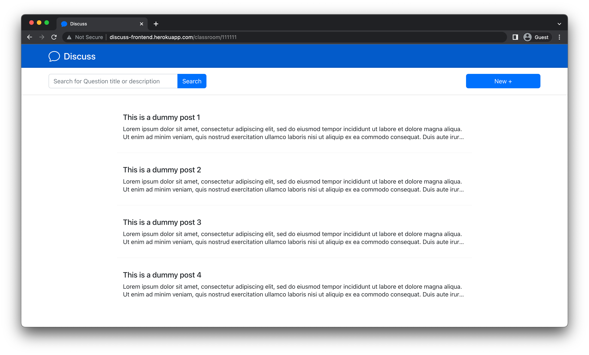
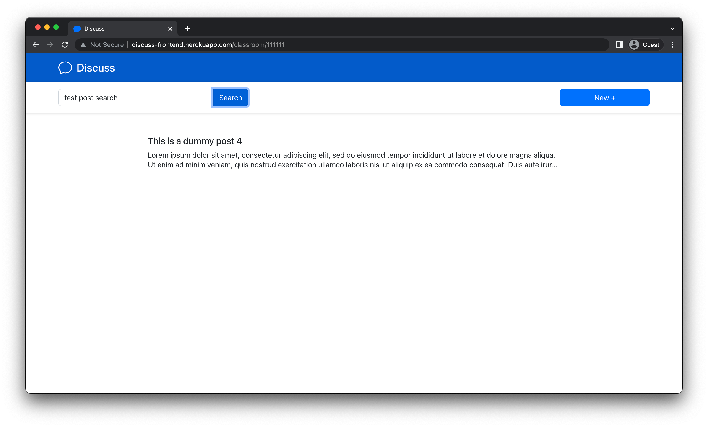
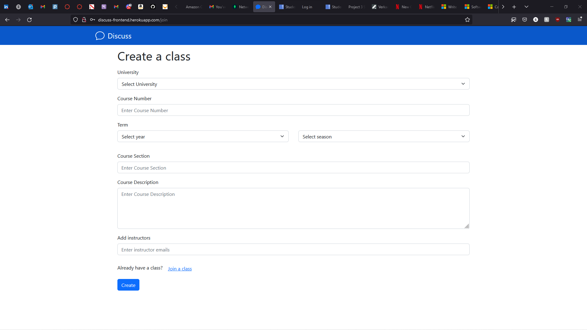
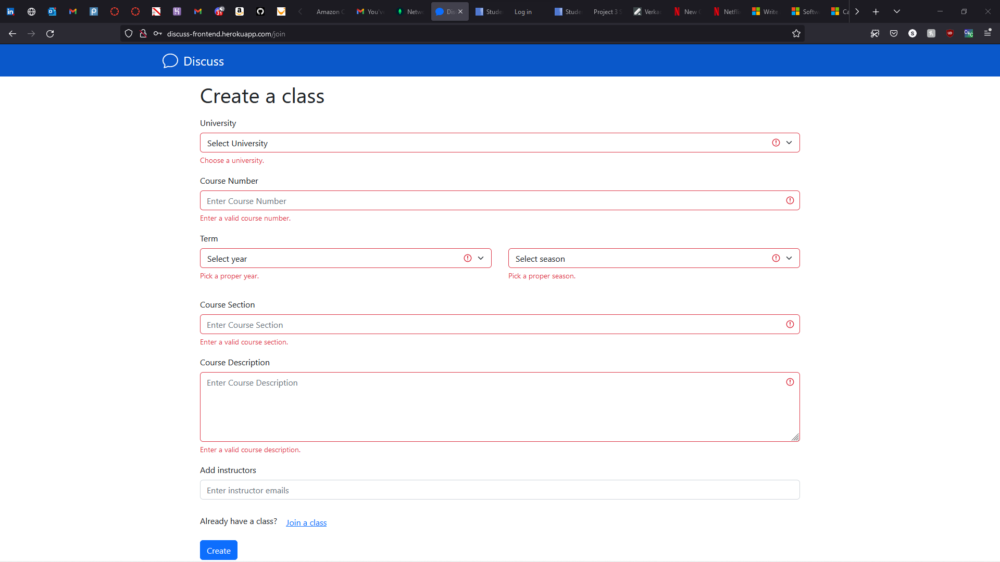
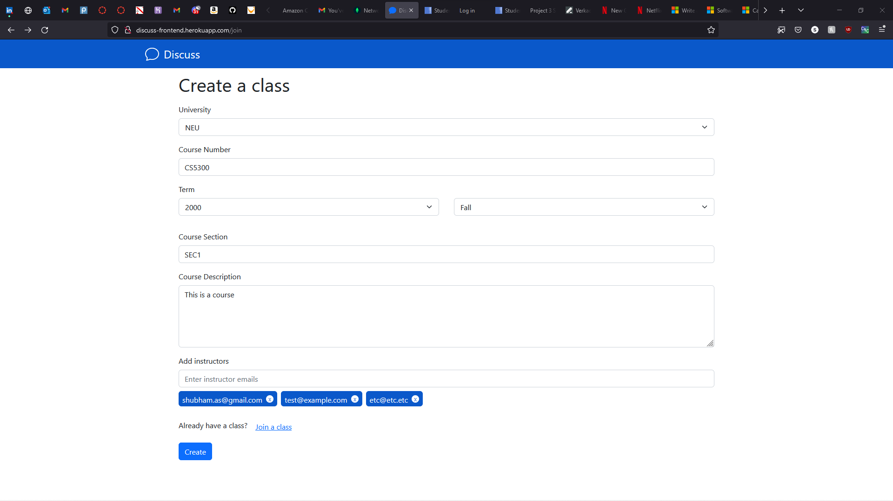
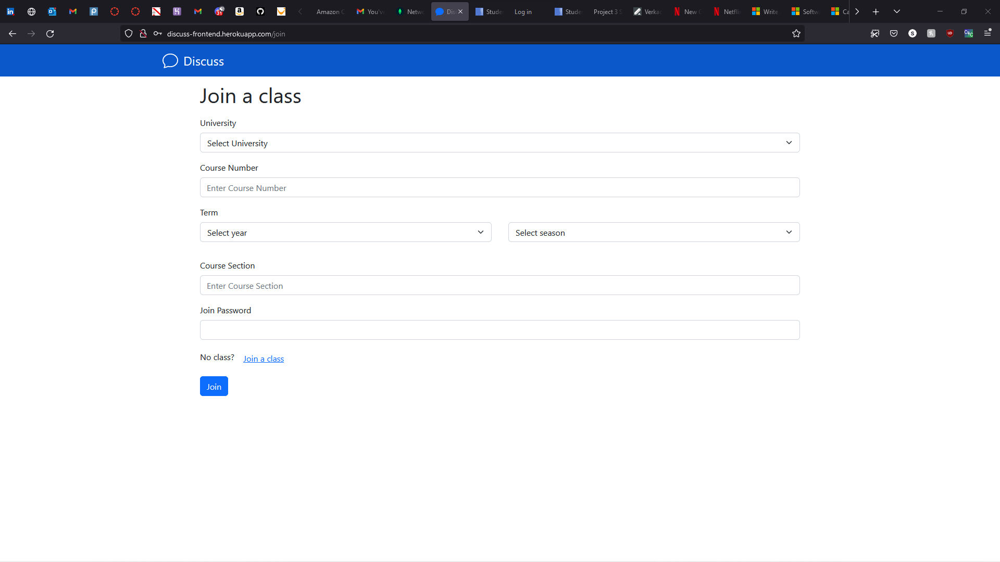
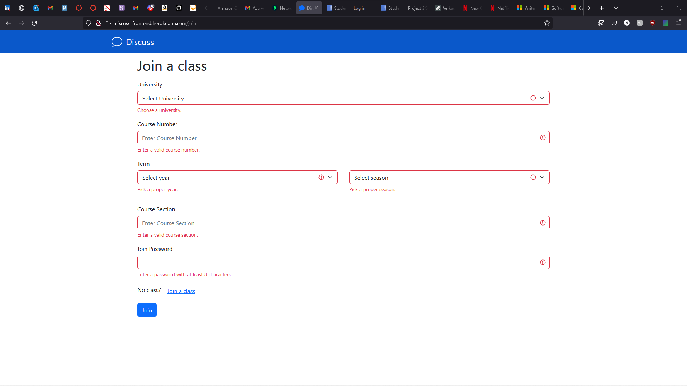
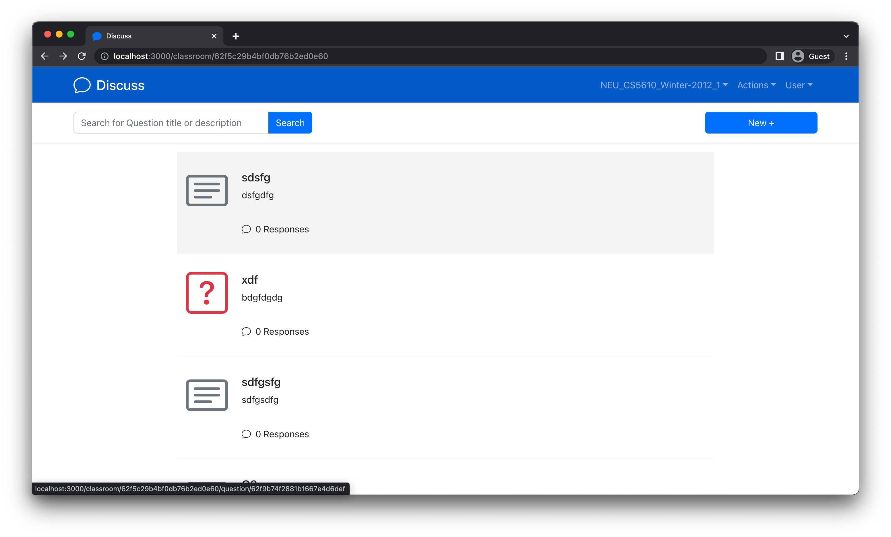
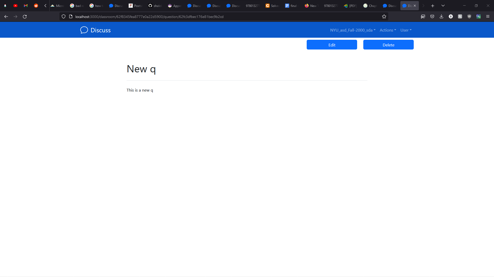
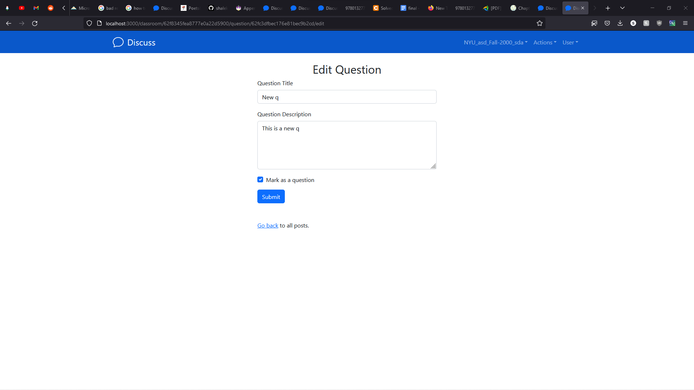

# Classroom Discussion Forum (Frontend)

_Classroom Discussion Forum_ is a platform for instructors and students to collectively solve doubts of other students.

**Heroku URL:** [https://discuss-frontend.herokuapp.com/](https://discuss-frontend.herokuapp.com/)

## Requirements Met:-

### 1) User interface with data by at least 2 CRUD operations (create, read, update, delete) for at least one database table

We have made the following CURD operations for the below mentioned database table.

#### a) Users :-

1. CREATE(Addition of a new user)
2. READ( Fetching the details of an existing user)

#### b) Question :-

1. CREATE(Addition of a new question)
2. READ( Fetching the details of an existing question)

#### c) Class :-

1. CREATE(Addition of a new class)
2. READ( Fetching the details of an existing class)
3. UPDATE(Updating a class)
4. DELETE(deleting a class)

#### d) Comments :-

1. CREATE(Addition of a new comment)
2. READ( Fetching the details of an existing comment)
3. UPDATE(Updating a comment)
4. DELETE(deleting a comment)

### 2) At least 3 different UI routes (appearing to the user as different pages)

### 3) At least one Bootstrap UI component not featured in the demo application.

       We have added react-bootstrap spinner as our bootsrap UI component to show a loading icon when
       the screen is getting refreshed.

### 4) Different layout and design from the demo application; it should not look like an obvious clone.

       Met the goal as the layout is completely different

### 5) 3rd party library for React (not including React DnD, unless its use is completely different from the use in the demo project)

       Usage of react-notifications library

## Contributors

- Anwesa Basu(basu.anw@northeastern.edu)
- Het Chetan Shah (shah.het2@northeastern.edu)
- Shubham Atul Parulekar (parulekar.s@northeastern.edu)
- Swapnendu Majumdar (majumdar.s@northeastern.edu)

## Iteration 1

For this iteration, we have completed a basic implementation of all of the pages in our frontend. We have also created the required API endpoints that, for now, sends mock data to the frontend.

### Contribution

- **Anwesa Basu**
  - Register a new user into the system.[Jump](#page-register)
  - View an existing post.[Jump](#page-view-post)
- **Het Shah:**
  - Revamped Questions list page [Jump](#page-questions-list-page)
  - Integrated all the branches into main and resolved merge conflicts
- **Shubham Parulekar:**
  - Create a class. [Jump](#page-create-a-class)
  - Join a class. [Jump](#page-join-a-class)
- **Swapnendu Majumdar:**
  - Log an existing user into the system. [Jump](#page-login)
  - Create a new post. [Jump](#page-create-a-post)

### _Page:_ Register

This page helps the user to sign up for the first time in the system.

#### User data validation:-

#### Form submission sucessful:-

### _Page:_ View Post

This page shows the details of one user post.

#### Post details for Question ID 1:-

#### Post details for Question ID 4:-

### _Page:_ List of questions

This page shows a list of questions that have been asked in a given class. The user can filter the questions based on the title or question description.

The user can filter the question based on title or description.

### _Page:_ Create a class

This page shows creation of a class. All fields are validated and the instructors takes multiple emails as input.

Blank form

Validation

Filled form

### _Page:_ Join a class

This page shows joining a class. All fields are validated.

Blank form

Validation

### _Page:_ Login

This page allows an existing user to login to the system.

### _Page:_ Create a post

This page allows a user to post a question in the classroom.

## Iteration 2

For this iteration, we have fleshed out various features. Most CURD operations are working. The APIs are now using the database.

### Contribution

- **Anwesa Basu**

  - Existing user validation and backend response handling for sign-up and sign-in pages.[Jump](#page-validation)
  - Implementing comment functionality to a posted question (In-progress)[Jump](#page-comment)
  - Integrated all the branches into main and resolved merge conflicts

- **Het Shah:**

  - Integrated Context API
  - New user registration page revamp [Jump](#page-registration)
  - Integrated all the branches into main and resolved merge conflicts

- **Shubham Parulekar:**

  - React notifications package setup. [Jump](#page-notification)
  - Class Actions dropdown and setup. [Jump](#page-class-actions-dropdown-and-setup)
  - Integrated all the branches into main and resolved merge conflicts

- **Swapnendu Majumdar:**
  - Implementing comment functionality to a posted question (In-progress). [Jump](#page-comment)
  - Login page UI Revamp. [Jump](#page-login)
  - Integrated all the branches into main and resolved merge conflicts

### _Page:_ Validation

### _Page:_ Comment

### _Page:_ Registration

### _Page:_ Notification

### _Page:_ Class Actions dropdown and setup

### _Page:_ Login

## Iteration 3

For this iteration, we have compleated edit and delete parts of post/question, added comment, bettered the error reporting and made the question UI better.

### Contribution

- **Anwesa Basu**

  - Addition of comment Edit feature. [Jump](#page-comment-edit)
  - Addition of comment delete feature. [Jump](#comment-delete)
  - Fetching of comments and showing in the view post screen. [Jump](#comment-fetch)

- **Het Shah:**

  - New user registration page revamp [Jump](#page-registration)
  - Imeplemented a preloader for the app [Jump](#component-preloader)
  - Integrated all the branches into main and resolved merge conflicts

- **Shubham Parulekar:**

  - Added edit and delete of question/post. [Jump](#page-edit-delete-post)
  - Bettered the error reporting.
  - Heroku deployment

- **Swapnendu Majumdar:**
  - Implementing add comment feature.[Jump](#page-comment-add)
  - implementing reply feature of comment on heirarchial basis.[Jump](#page-comment-reply)
  - Creation of comment file structures including addition of 3 components and one dataservice file.

### _Page:_ Comment edit

As part of this feature have added a edit button to edit every comment posted by the user.

### comment-delete

As part of this feature have added a delete button to delete every comment posted by the user.

### comment-fetch

As part of this feature I have added the functionality to fectch all comments on every render of the screen.

### _Page:_ Questions list page

Added card icon to distinguish between a question and a post. Also, added comments count for a question/post.

### _Page:_ Edit Delete Post

### _Page:_ Comment add

As part of this feature have added an add comment button to add every comment posted by the user.

### _Page:_ Comment reply

As part of this feature have added an reply comment button to reply to an existing comment of an user.

### _Component_: Preloader

